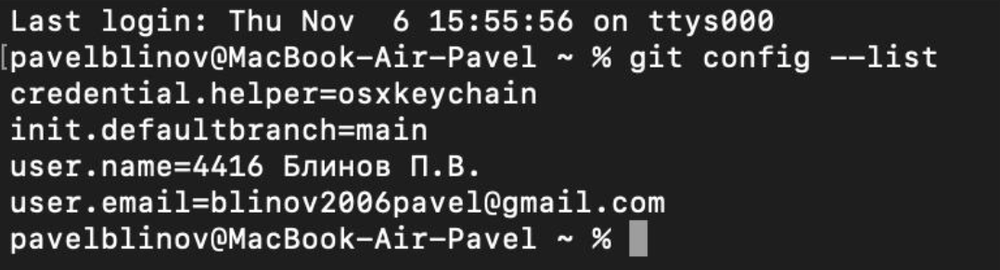
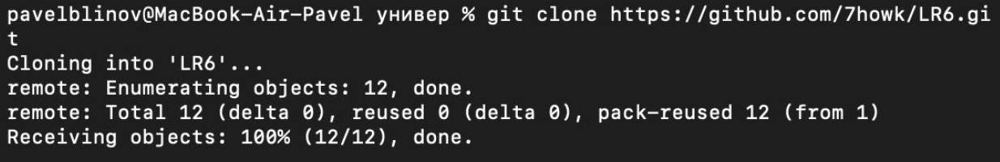
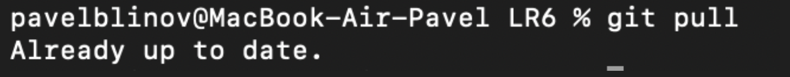
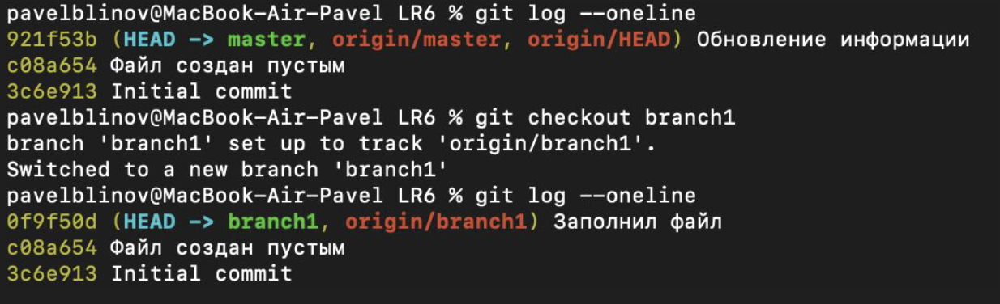
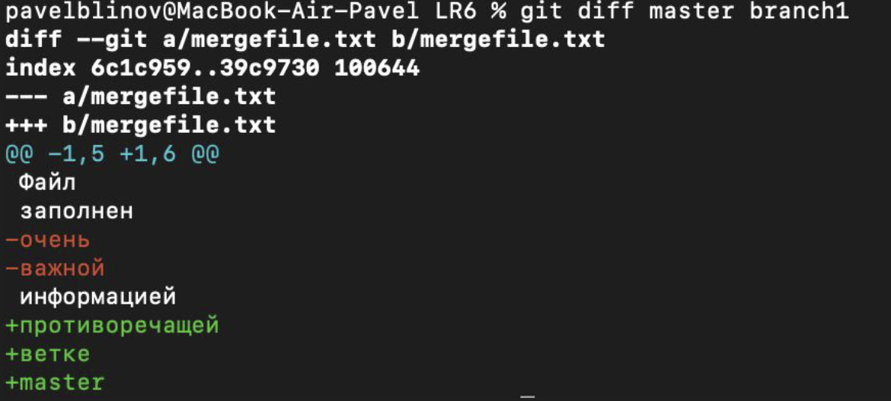
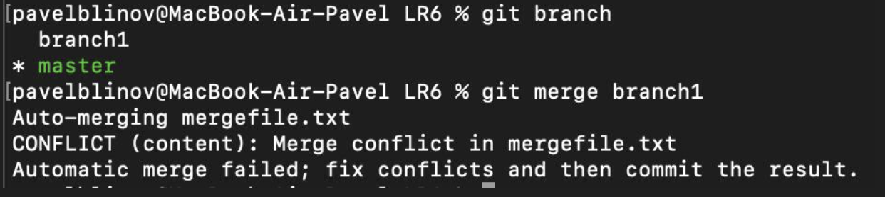
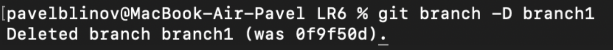
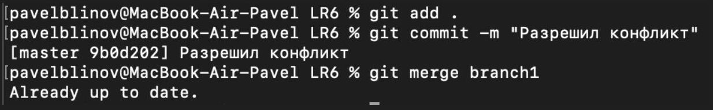
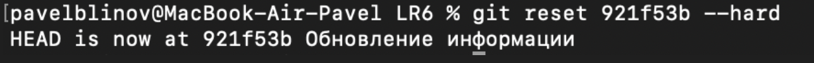
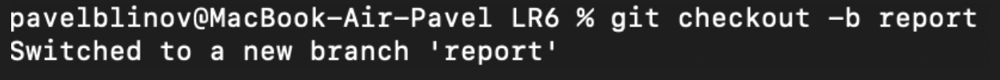

# LR6
Лабораторная работа №6

### Выполнил Блинов Павел 4416

1. Сделать аккаунт 

2. Сделать копию в личное хранилище 
3. Установка Git (уже был установлен)
4. Настроить клиент Git (уже был настроен)

5. Клонировать свой личный удалённый репозиторий на компьютер 

6. Подтянуть изменения

7. История операций для каждой из веток

8. Последние изменения

9. Слияние

10. Удалить ветку

11. Изменения и их фиксация

12. Откат коммита

13. Ветка для отчета и создание README.md

14. История операций 

## Вывод

В ходе работы я научилась пользоваться системой Git и сайтом GitHub: создавать и клонировать репозитории, работать с ветками, делать коммиты, сливать изменения и решать конфликты. Также я оформила отчёт с описанием выполненных действий и скриншотами. Благодаря этой лабораторной работе я поняла основы управления версиями и научилась применять Git для разработки проектов.
